# PES-VCS Lab Report

## Student Details

- Name:Aaruni CHoudhary
- SRN: PES2UG24CS013
- GitHub Repository: `https://github.com/missyrue/PES2UG24CS013-pes-vcs`

## Overview

This report documents the PES-VCS implementation across the object store, tree construction, index management, and commit creation phases. It also includes placeholders for all required screenshots and written answers to the analysis questions from the lab handout.

## Phase 1: Object Storage Foundation

### Summary

In this phase, `object_write` and `object_read` were implemented in `object.c`. The design follows Git-style content-addressable storage:

- Objects are stored as `"<type> <size>\0<data>"`.
- The SHA-256 hash of the full serialized object is used as the object ID.
- Objects are sharded under `.pes/objects/XX/` using the first two hex characters.
- Writes use a temporary file followed by `rename()` to keep object creation atomic.
- Reads recompute the hash and compare it with the requested object ID to detect corruption.

### Screenshot 1A: `./test_objects`

Placeholder:

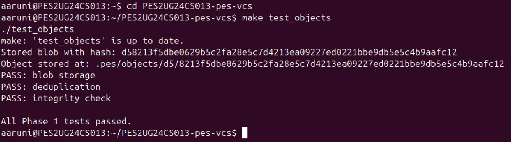
### Screenshot 1B: Object Store Layout

Placeholder:

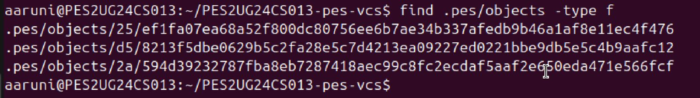
## Phase 2: Tree Objects

### Summary

In this phase, `tree_from_index` was implemented in `tree.c`.

- The index is loaded into memory.
- Paths are grouped by prefix to reconstruct directory hierarchy.
- Nested paths such as `src/main.c` create subtree objects recursively.
- File entries keep their mode and hash from the index.
- Directory entries use tree mode and point to recursively written subtree objects.
- Each tree is serialized deterministically before being stored as an object.

### Screenshot 2A: `./test_tree`

Placeholder:

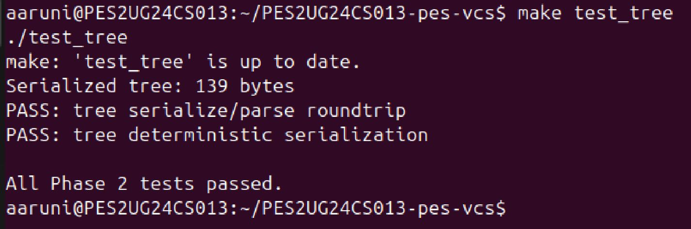
### Screenshot 2B: Raw Tree Object

Placeholder:

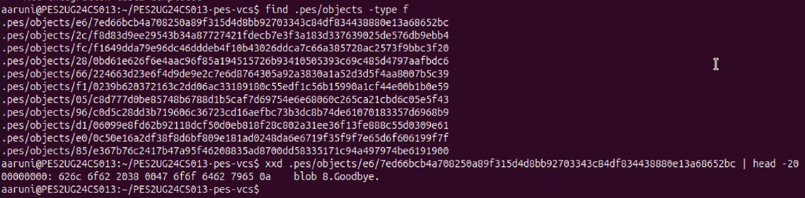

## Phase 3: Index (Staging Area)

### Summary

In this phase, `index_load`, `index_save`, and `index_add` were implemented in `index.c`.

- `index_load` parses `.pes/index` from its text representation into memory.
- Missing index files are treated as an empty staging area rather than an error.
- `index_save` sorts entries by path and writes them atomically through a temporary file.
- `index_add` validates the target file, stores its contents as a blob object, updates metadata, and saves the index.
- The index stores mode, object hash, modification time, size, and path for each staged file.

### Screenshot 3A: `pes init` -> `pes add` -> `pes status`

Placeholder:

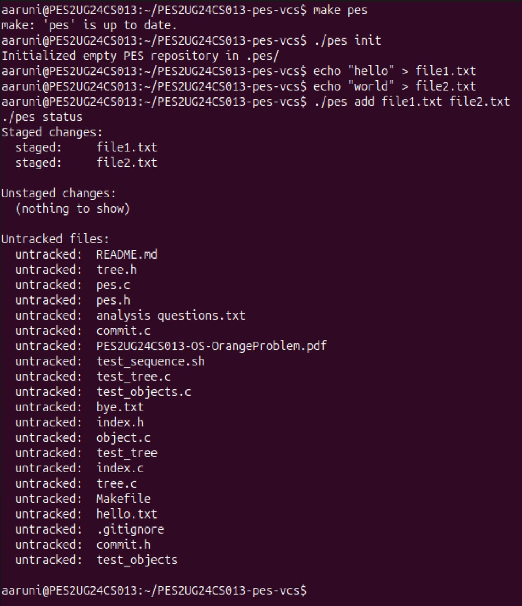

### Screenshot 3B: `.pes/index`

Placeholder:

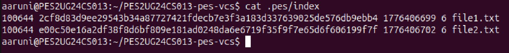

## Phase 4: Commits and History

### Summary

In this phase, `commit_create` was implemented in `commit.c`.

- The staged snapshot is converted into a root tree using `tree_from_index()`.
- The current `HEAD` is read to determine the parent commit if one exists.
- Author information is taken from `pes_author()`.
- A commit object is serialized and written to the object store.
- The current branch reference is updated atomically to point to the new commit.

### Screenshot 4A: `pes log`

Placeholder:

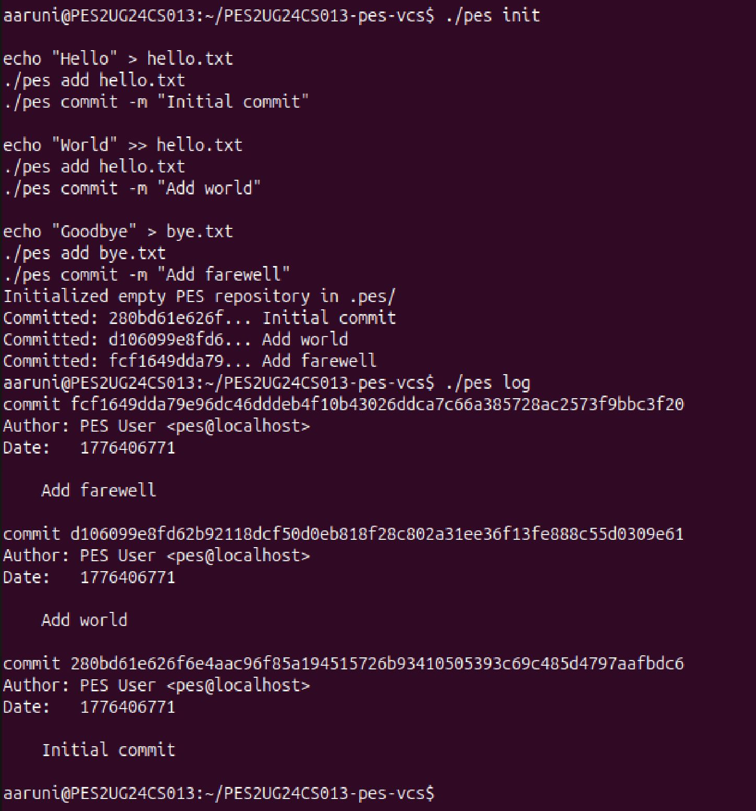
### Screenshot 4B: Repository File Growth

Placeholder:

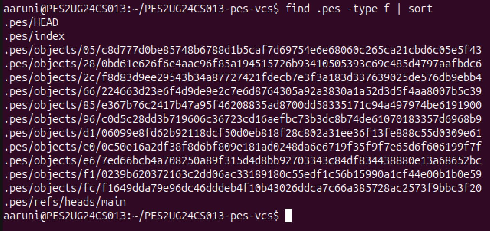

### Screenshot 4C: `HEAD` and Branch Reference

Placeholder:

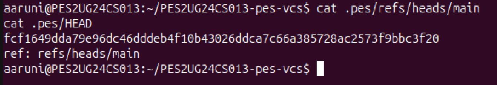

## Final Integration Test

Placeholder:

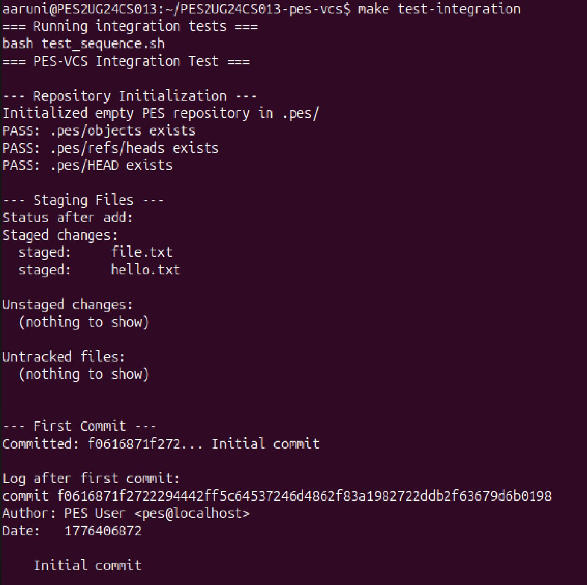
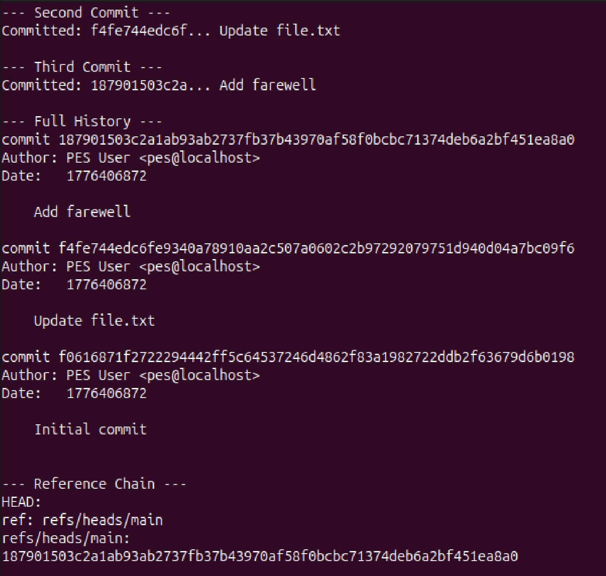
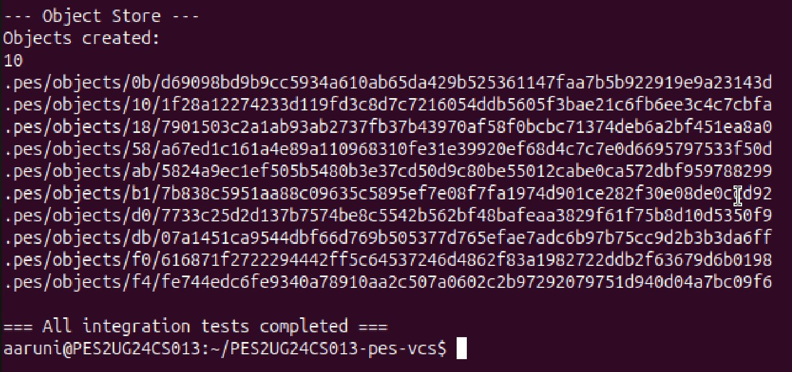
## Phase 5: Analysis Answers

### Q5.1: How would `pes checkout <branch>` work?

A branch is just a reference file under `.pes/refs/heads/`, so checkout would first read the target branch file to get the commit hash. `HEAD` would then be updated to `ref: refs/heads/<branch>`. After that, the working directory must be rewritten to match the target commit's root tree by walking commit -> tree -> blobs and materializing the corresponding files and directories on disk.

The complex part is that checkout is not only a metadata update. It must safely transform the working directory from one snapshot to another. That includes creating files, deleting files that no longer exist, creating and removing directories, restoring executable permissions, and handling conflicts with uncommitted local changes. The operation becomes a coordinated filesystem update rather than a simple pointer switch.

### Q5.2: How would you detect a dirty working-directory conflict?

The index already stores each tracked file's path, mtime, size, mode, and blob hash. To detect conflicts, I would:

1. Load the current index.
2. Read the current branch's tree and the target branch's tree.
3. For each tracked path, compare the working directory file against the index entry.

If the file's metadata differs from the index entry, I would treat it as potentially modified. For stronger validation, I would read the file, hash it as a blob, and compare that hash to the index hash. If the working file differs from the index and the same path also differs between the current branch and target branch trees, checkout must refuse because the branch switch would overwrite an uncommitted change.

This uses the index as the expected staged state and the object store as the authoritative source for committed snapshots.

### Q5.3: What happens in detached HEAD state?

In detached HEAD state, `HEAD` contains a commit hash directly instead of pointing to a branch reference. New commits are still created normally, but no branch file moves forward with them. That means the commits exist in the object store, but they can become unreachable once the user checks out another branch.

A user can recover those commits if they still know the hash. The simplest recovery is to create a new branch pointing at the detached commit. In a fuller implementation, a reflog-like mechanism would make recovery easier, but even without that, any reachable commit hash can be saved again by writing a branch ref that points to it.

## Phase 6: Garbage Collection Answers

### Q6.1: How would you find and delete unreachable objects?

The standard approach is mark-and-sweep:

1. Start from every root reference, such as all files under `.pes/refs/heads/` and possibly `HEAD` if detached.
2. Mark each referenced commit as reachable.
3. For each reachable commit, visit its parent commit and its tree.
4. For each reachable tree, visit every referenced subtree and blob.
5. Store every visited object hash in a hash set for O(1) membership checks.
6. After traversal, scan `.pes/objects/` and delete any object whose hash is not in the reachable set.

The right data structure is a hash set keyed by object hash, because reachability checks happen repeatedly and must stay fast.

For a repository with 100,000 commits and 50 branches, the traversal cost depends on overlap. In the worst case, if branches are mostly independent, GC may need to visit around all 100,000 reachable commits plus their associated trees and blobs. In a more typical case, many branches share history, so the number of unique commits visited is still closer to the total unique commit graph, not `100000 * 50`. The total object visits would therefore be on the order of all reachable commits plus all unique reachable trees and blobs.

### Q6.2: Why is concurrent GC dangerous?

GC is dangerous during a concurrent commit because a new commit is built in stages. Suppose the commit process writes new blob objects and tree objects first, but has not yet written the final commit object or updated the branch ref. A concurrent GC that only starts from current refs will not see those newly written objects as reachable, because no branch points to them yet. It could delete them before the commit finishes. The commit would then create a ref to objects that no longer exist, corrupting the repository state.

Git avoids this with a combination of reachability rules, temporary protection mechanisms, and careful coordination. Real Git also uses loose-object grace periods, packfile handling, and other safety checks so that very recent objects are not immediately collected while concurrent operations may still be in progress.

## Conclusion

The lab demonstrates the core ideas behind Git internals using a simplified repository design. The implementation shows how blobs, trees, commits, refs, and the index cooperate to represent snapshots, history, and staging while relying on filesystem primitives such as hashing, atomic rename, and directory traversal.
